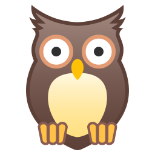

<p align='center'></p>
<h1 align='center'>Simulated Time</h1>

<p align="center">A testing (and partial) replacement for Python's <code>time</code> package, for fully-controlled time-dependent tests.</p>

<br /><br />

Testing functions that depend on time is always tricky, and can take long. To save time and avoid relying on `time.sleep()`, this package allows to fast-forward time arbitrarily.

It implements the functions `stime.time()` and `stime.monotonic()`.

<br />

> **Note**: This package in not meant to replace [`time`][time] in production! Only in testing environments!

  [time]: https://docs.python.org/3/library/time.html

Usage
-----

The idea is to make your code to use `stime.test()` instead of `time.test()` while it is being tested.

Ideally, the code you want to test is receiving a time source through _dependency injection_, like the `Timer` class in the example below.

If the code you are testing is not using dependency injection, it is likely that you can still override the time function in your tests. That is less elegant, but can be a fair trade-off to avoid having its test suite rely on `time.sleep()`.

Once your code is using `stime`, you can precisely control the output of `stime.time()` (or `stime.monotonic()`) using `stime.reset()` and `stime.tick()`:

- **`tick(n)`**: increments the current time by `n` seconds (e.g. `1.3` seconds)
- **`reset(t)`**: (re-)sets the current time to the timestamp `t` (e.g. `1561120200`)

### Example using dependency injection

```python
# timer.py

# An example timer that conveniently injects its time source dependency.

class Timer:
  """A timer the rings for 5 seconds when an alarm time is reached."""

  def __init__(self, time_source): # the time source is injected here, which is nice
    """Creates a new timer based on a time source.

    An adequate time source would typically be the time package
    from the standard library.

    Example:

            import time
            from timer import Timer

            reminder = Timer(time_source: time)

    """
    self.time_source = time_source

  def set_alarm(self, time):
    """Sets and alarm time using a timestamp."""
    self.alarm_time = time

  def is_ringing(self):
    """Whether the timer is ringing."""
    now = self.time_source.time() # depends on the current time!
    if self.alarm_time <= now <= self.alarm_time + 5:
      return True
    else:
      return False
```

```python
# test_timer.py

import unittest
import stime
from timer import Timer # your package with time-dependent functions to be tested

class TestTimer(unittest.TestCase):

    def test_timer_does_not_ring_before_set_time(self):
        # create a new timer using stime as a time source
        cooking_timer = Timer(time_source=stime)
        cooking_timer.set_alarm(1561120200) # Unix timestamp for 06 June 2019 around noon

        stime.reset(1561120199) # a second before alarm time
        is_ringing = cooking_timer.is_ringing() # calls stime.time() because it is the timer time_source
        self.assertEqual(is_ringing, False, "expected the timer NOT to ring before alarm time")

    def test_timer_rings_at_set_time(self):
        # create a new timer using stime as a time source
        cooking_timer = Timer(time_source=stime)
        cooking_timer.set_alarm(1561120200) # Unix timestamp for 06 June 2019 around noon

        stime.reset(1561120200) # exactly alarm time
        is_ringing = cooking_timer.is_ringing() # calls stime.time() because it is the timer time_source
        self.assertEqual(is_ringing, True, "expected the timer to ring at alarm time")

    def test_timer_rings_for_five_seconds(self):
        # create a new timer using stime as a time source
        cooking_timer = Timer(time_source=stime)
        cooking_timer.set_alarm(1561120200) # Unix timestamp for 06 June 2019 around noon

        stime.reset(1561120205) # 5 seconds after alarm time
        is_ringing = cooking_timer.is_ringing() # calls stime.time() because it is the timer time_source
        self.assertEqual(is_ringing, True, "expected the timer to be ringing 5 seconds after alarm time")

        stime.tick() # add 1 more second
        is_ringing = cooking_timer.is_ringing() # calls stime.time() because it is the timer time_source
        self.assertEqual(is_ringing, False, "expected the timer NOT to be ringing 6 seconds after alarm time")

if __name__ == '__main__':
    suite = unittest.TestLoader().loadTestsFromTestCase(TestTimer)
    unittest.TextTestRunner(verbosity=2).run(suite)
```

Credits
-------

The owl emoji in the header was rendered from an SVG that belongs to Google and [was published under the Apache License v2.0 as part of Noto Emoji](https://github.com/googlei18n/noto-emoji).

License
-------

    stime
    Copyright (C) 2019 Gonzalo Bulnes Guilpain

    This program is free software: you can redistribute it and/or modify
    it under the terms of the GNU General Public License as published by
    the Free Software Foundation, either version 3 of the License, or
    (at your option) any later version.

    This program is distributed in the hope that it will be useful,
    but WITHOUT ANY WARRANTY; without even the implied warranty of
    MERCHANTABILITY or FITNESS FOR A PARTICULAR PURPOSE.  See the
    GNU General Public License for more details.

    You should have received a copy of the GNU General Public License
    along with this program.  If not, see <http://www.gnu.org/licenses/>.
